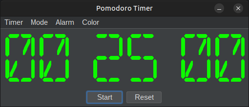
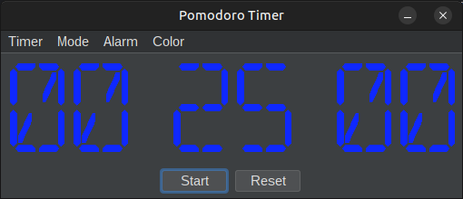
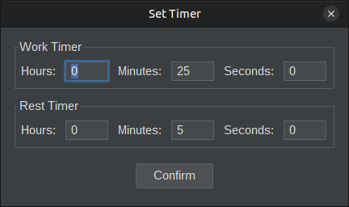

# The Flemoid's Pomodoro Timer
I wanted a Pomodoro (or standard) timer to help with productivity at work, and, while there are plenty of them around, this seemed like a simple enough problem that I could just roll my own for fun.  Being that this was a relatively small application (in terms of features and user controls), I decided to implement it using good old Java Swing instead of JavaFX or anything more fancy than that.  It's been about five years since I've implemented anything Java Swing, so this was a fun refresher project.

This project is ***MOSTLY*** dependency-less, with one glaring exception.  GStreamer.  Right now I'm using GStreamer to simply play audio alert tones, that's it.  These are just .wav files, and I'm hopeful that I can reliably play them on something with core Java (not relying on JNI), but during testing I couldn't get the [javax.sample.Clip](https://docs.oracle.com/javase/8/docs/api/javax/sound/sampled/Clip.html) interface to work with Bluetooth devices or PulseAudio, and that was a dealbreaker in the short term.  Will maybe look more into that in the future.

But, given that for now this is using GStreamer for audio playback, that means GStreamer has to be installed on the end system (in a very minimal way I think, I only use the filesrc, wavparse, audioconvert, and audiosink elements).  GStreamer is generally good with their installation instructions, I'll defer to those [here](https://gstreamer.freedesktop.org/documentation/installing/index.html?gi-language=c) unless someone says otherwise.

-----

## Features:

Now on to the features!  This is a Pomodoro timer for work productivity, implmented in full Java / Java Swing.  It also serves as a standard Timer, in case you need one of those.  Input a time to countdown from, and it will alert you when that is reached.  For Pomodoro, input a `Work Time` and a `Break Time`, and it will cycle between those two.  This seems like a silly productivity tool, but I've actually found it very effective for my work, hence my work here.

It also comes with a snazzy dark UI!

<p align="center">
    
</p>

---

## Utilization:

For usage, you're best off just downloading the pre-compiled JAR and untarring it into your `$PATH` directory.  Nothing special, just make sure the provided run script is accessible and you're good to go (scripts provided in both `.sh` and `.bat` form).  Oh and you need to have Java 21 installed!  If you want to build it yourself, that's easy enough as we're using the [Gradle build system](https://gradle.org/).  Simply run:
```
./gradlew clean build
```
from the root directory of this project, and as long as you have Java 21 or greater installed, you'll be fine.

For requirements, this requires GStreamer to be installed, and at least Java 21.  Java 21 was selected as it's the latest LTE version of Java, nothing special.  Java Swing has been around forever, so if you want to try to spin it down to Java 11 or 8, you can do so in the [build.gradle](/build.grade#L16) file and it will probably work (though I haven't tried it).

---

### More Features / Outro:

This offers multiple alert tones, volume settings, setting of work/rest timer lengths, multiple font colors, and more!  I made this whole thing in a day or two, basically just cause I thought it'd be fun to spin my own implementation of tools that I found useful.  If you want more features, feel free to file a PR, or ask and I may just go ahead and implement them myself.





I'm actually kind proud of this one, since I've found it to be useful and cause I did it in a weekend where I was forced to sit around for awhile.
